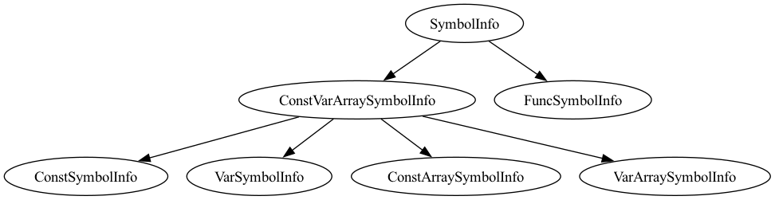

# 编译原理实验二：中间代码生成

[TOC]

## 小组成员
朱徐塬、陈嘉康、楼云韬

## 1. 任务说明

本次实验实现了CACT语言编译器的中间代码生成部分，主要完成以下任务：

1. 设计并实现中间代码生成模块，将AST转换为LLVM IR
2. 实现基本的类型系统和类型检查
3. 支持LLVM IR的生成、打印输出和解释执行
4. 确保生成的IR代码可以通过llc编译和lli解释执行

### 1.1 编译流程

编译过程主要包括以下步骤：

1. 词法分析和语法分析生成AST
2. 语义分析检查类型和作用域
3. IR生成器将AST转换为中间代码
4. 生成LLVM IR并执行


## 2. 实验设计

### 2.1 总体设计

本实验的主要代码结构包括：

- `src/`：源代码目录
  - `IR/`：IR相关的核心代码
    - `IRValue.h/cpp`：IR值的基类
    - `IRType.h/cpp`：IR类型系统
    - `IRFunction.h/cpp`：函数表示
    - `IRModule.h/cpp`：模块表示
    - `IRInstruction.h/cpp`：指令表示
    - `IRBasicBlock.h/cpp`：基本块表示
    - `IRConstant.h/cpp`：常量表示
    - `iMemory.h/cpp`、`iOperators.h/cpp`等：各种指令实现
  - `SemanticAnalyzer.h/cpp`：语义分析器
  - `IRGenerator.h/cpp`：IR生成器
  - `symbolTable.h/cpp`：符号表实现
  - `main.cpp`：主程序

### 2.2 中间代码设计

我们的IR设计参考了LLVM IR的结构，采用了SSA（静态单赋值）形式。IR的核心是值（Value）的概念，所有的操作数和结果都是值。

#### 2.2.1 IR值层次结构

IR值的层次结构如下：

1. `IRValue`：所有IR元素的基类
   - `IRType`：类型表示
   - `IRUser`：使用其他值的IR元素
     - `IRConstant`：常量值
     - `IRInstruction`：指令
     - `IRGlobalValue`：全局值
       - `IRFunction`：函数
       - `IRGlobalVariable`：全局变量
   - `IRArgument`：函数参数
   - `IRBasicBlock`：基本块

这种设计使得我们可以统一处理不同类型的IR元素，并且方便实现use-def链和def-use链。


#### 2.2.2 IR类型系统

我们实现了以下基本类型：
- `i32`：32位整数
- `float`：单精度浮点数
- `double`：双精度浮点数
- `i1`：布尔类型
- `void`：空类型
- 数组类型：支持一维和多维数组
- 函数类型：包含返回类型和参数类型
- 指针类型：用于变量引用和数组操作

类型系统的设计考虑了以下几个方面：
1. 类型检查和转换
2. 类型兼容性判断
3. 类型大小计算
4. 派生类型构建

#### 2.2.3 IR指令设计

主要支持以下类型的指令：

1. 内存操作
```llvm
; 分配栈空间
%ptr = alloca i32
; 加载
%val = load i32, i32* %ptr
; 存储
store i32 %val, i32* %ptr
; 内存复制
memcpy [4 x i32]* %dest, [4 x i32]* %src
```

2. 算术运算
```llvm
; 整数运算
%add = add i32 %a, %b
%sub = sub i32 %a, %b
%mul = mul i32 %a, %b
%div = sdiv i32 %a, %b
%rem = srem i32 %a, %b

; 浮点运算
%fadd = fadd float %x, %y
%fsub = fsub float %x, %y
%fmul = fmul float %x, %y
%fdiv = fdiv float %x, %y
```

3. 比较运算
```llvm
; 整数比较
%cmp = icmp slt i32 %a, %b  ; a < b
%cmp = icmp sgt i32 %a, %b  ; a > b
%cmp = icmp sle i32 %a, %b  ; a <= b
%cmp = icmp sge i32 %a, %b  ; a >= b
%cmp = icmp eq i32 %a, %b   ; a == b
%cmp = icmp ne i32 %a, %b   ; a != b

; 浮点比较
%fcmp = fcmp olt float %a, %b  ; a < b
```

4. 控制流
```llvm
; 条件跳转
br i1 %cond, label %then, label %else
; 无条件跳转
br label %next
; 函数返回
ret i32 %result
ret void
```

5. 函数调用
```llvm
; 函数调用
%result = call i32 @func(i32 %arg)
call void @print_int(i32 %value)
```

### 2.3 符号表设计

符号表采用了层次化的设计，主要包括以下几个类：

1. `SymbolInfo`：符号基类
   - `ConstVarArraySymbolInfo`：常量、变量和数组的基类
     - `ConstSymbolInfo`：常量符号
     - `VarSymbolInfo`：变量符号
     - `ConstArraySymbolInfo`：常量数组符号
     - `VarArraySymbolInfo`：变量数组符号
   - `FuncSymbolInfo`：函数符号

2. `BlockInfo`：作用域块，包含符号表
   - `GlobalBlock`：全局作用域，包含全局变量和函数

符号表的设计考虑了以下几个方面：
1. 作用域管理
2. 符号查找效率
3. 类型信息存储
4. IR值关联



## 3. 实验实现

### 3.1 语义分析实现

语义分析器(`SemanticAnalyzer`)通过遍历AST，完成以下任务：

1. 构建符号表
2. 类型检查
3. 作用域检查
4. 数组边界检查
5. 函数参数检查

关键实现包括：

```cpp
// 变量声明处理
std::any SemanticAnalyzer::visitVariableDefinition(CACTParser::VariableDefinitionContext *context) {
    size_t line = context->Identifier()->getSymbol()->getLine();
    for (auto size: context->IntegerConstant()) {
        context->arraySize.push_back(stoi(size->getText()));
    }
    size_t dimension = context->arraySize.size();
    std::string name = context->Identifier()->getText();
    
    // 根据是否为数组创建不同类型的符号
    if (dimension == 0) {
        currentSymbol = this->currentBlock->addNewVar(name, line, context->dataType);
    } else {
        currentSymbol = this->currentBlock->addNewVarArray(name, line, context->dataType,
                                                           context->arraySize, dimension);
    }

    // 处理初始化
    if (context->constantInitValue() != nullptr) {
        context->constantInitValue()->dataType = context->dataType;
        context->constantInitValue()->arraySize = context->arraySize;
        context->constantInitValue()->dimension = dimension;
        this->visit(context->constantInitValue());
    } else {
        // 默认初始化为0
        unsigned loop = dimension == 0 ? 1 : 
            std::accumulate(context->arraySize.begin(), context->arraySize.end(), 1, std::multiplies());
        for (int i = 0; i < loop; i++) {
            currentSymbol->setZero(context->dataType);
        }
    }
    
    return {};
}
```

### 3.2 IR生成器实现

IR生成器(`IRGenerator`)负责将AST转换为IR代码，主要工作包括：

1. 生成全局变量和函数
2. 生成基本块和控制流
3. 生成各种指令

关键实现包括：

```cpp
// 处理二元加法表达式
std::any IRGenerator::visitAdditiveExpression(CACTParser::AdditiveExpressionContext *context) {
    auto len = context->multiplicativeExpression().size();
    if (len == 1) {
        context->multiplicativeExpression(0)->trueBlock = context->trueBlock;
        context->multiplicativeExpression(0)->falseBlock = context->falseBlock;
    }
    auto ret = std::any_cast<IRValue *>(visit(context->multiplicativeExpression(0)));
    for (int i = 1; i < len; ++i) {
        auto val = std::any_cast<IRValue *>(visit(context->multiplicativeExpression(i)));
        IRInstruction::BinaryOps op;
        std::string opSt = context->additiveOp(i - 1)->getText();
        if (opSt == "+") {
            op = IRInstruction::Add;
        } else {  // "-"
            op = IRInstruction::Sub;
        }
        ret = IRBinaryOperator::create(op, ret, val, std::to_string(currentIRFunc->getCount()),
                                       currentIRBasicBlock);
        currentIRFunc->addCount();
    }
    return ret;
}

// 处理if语句
std::any IRGenerator::visitSelectionStatement(CACTParser::SelectionStatementContext *context) {
    IRBasicBlock *thenBlock = new IRBasicBlock(std::to_string(currentIRFunc->getCount()));
    currentIRFunc->addCount();
    IRBasicBlock *elseBlock = nullptr;
    IRBasicBlock *endBlock = new IRBasicBlock(std::to_string(currentIRFunc->getCount()));
    currentIRFunc->addCount();
    
    if (context->statement().size() > 1) {
        elseBlock = new IRBasicBlock(std::to_string(currentIRFunc->getCount()));
        currentIRFunc->addCount();
    } else {
        elseBlock = endBlock;
    }
    
    context->condition()->trueBlock = thenBlock;
    context->condition()->falseBlock = elseBlock;
    visit(context->condition());
    
    thenBlock->setParent(currentIRFunc);
    currentIRFunc->addBasicBlock(thenBlock);
    currentIRBasicBlock = thenBlock;
    visit(context->statement(0));
    new IRBranchInst(endBlock, currentIRBasicBlock);
    
    if (context->statement().size() > 1) {
        elseBlock->setParent(currentIRFunc);
        currentIRFunc->addBasicBlock(elseBlock);
        currentIRBasicBlock = elseBlock;
        visit(context->statement(1));
        new IRBranchInst(endBlock, currentIRBasicBlock);
    }
    
    endBlock->setParent(currentIRFunc);
    currentIRFunc->addBasicBlock(endBlock);
    currentIRBasicBlock = endBlock;
    
    return {};
}
```

### 3.3 IR类型系统实现

IR类型系统的核心是`IRType`类，它定义了各种类型及其操作：

```cpp
class IRType : public IRValue {
public:
    enum PrimitiveID {
        VoidTyID = 0,
        BoolTyID,
        IntTyID,
        FloatTyID,
        DoubleTyID,
        TypeTyID,
        LabelTyID,
        FunctionTyID,
        ArrayTyID,
        PointerTyID,
        NumPrimitiveIDs,
        FirstDerivedTyID = FunctionTyID,
    };

private:
    PrimitiveID ID;

public:
    // 判断类型属性
    bool isInteger() const { return 0; }
    bool isIntegral() const { return isInteger() || ID == BoolTyID; }
    bool isFloatingPoint() const { return ID == FloatTyID || ID == DoubleTyID; }
    bool isPrimitiveType() const { return ID < FirstDerivedTyID; }
    bool isDerivedType() const { return ID >= FirstDerivedTyID; }
    
    // 获取类型大小
    unsigned getPrimitiveSize() const;
    
    // 获取基本类型
    static const IRType *getPrimitiveType(PrimitiveID IDNumber);
    
    // 预定义的基本类型
    static IRType *VoidTy, *BoolTy;
    static IRType *IntTy;
    static IRType *FloatTy, *DoubleTy;
    static IRType *TypeTy, *LabelTy;
};
```

### 3.4 代码生成示例

以下是一些典型代码生成的示例：

1. 变量声明和初始化：
```llvm
; int a = 10;
%1 = alloca i32
store i32 10, i32* %1
```

2. 数组声明和初始化：
```llvm
; int arr[3] = {1, 2, 3};
%2 = alloca [3 x i32]
%3 = getelementptr [3 x i32], [3 x i32]* %2, i32 0, i32 0
store i32 1, i32* %3
%4 = getelementptr [3 x i32], [3 x i32]* %2, i32 0, i32 1
store i32 2, i32* %4
%5 = getelementptr [3 x i32], [3 x i32]* %2, i32 0, i32 2
store i32 3, i32* %5
```

3. if语句：
```llvm
; if (a > b) { ... } else { ... }
%6 = load i32, i32* %a
%7 = load i32, i32* %b
%8 = icmp sgt i32 %6, %7
br i1 %8, label %9, label %10

9:                                                ; preds = %0
  ; then块的代码
  br label %11

10:                                               ; preds = %0
  ; else块的代码
  br label %11

11:                                               ; preds = %10, %9
  ; 继续执行
```

4. while循环：
```llvm
; while (i < 10) { ... }
br label %12

12:                                               ; preds = %14, %0
  %13 = load i32, i32* %i
  %14 = icmp slt i32 %13, 10
  br i1 %14, label %15, label %16

15:                                               ; preds = %12
  ; 循环体代码
  br label %12

16:                                               ; preds = %12
  ; 继续执行
```

5. 函数定义和调用：
```llvm
; int add(int a, int b) { return a + b; }
define i32 @add(i32 %0, i32 %1) {
  %3 = alloca i32
  %4 = alloca i32
  store i32 %0, i32* %3
  store i32 %1, i32* %4
  %5 = load i32, i32* %3
  %6 = load i32, i32* %4
  %7 = add i32 %5, %6
  ret i32 %7
}

; 函数调用
%8 = call i32 @add(i32 5, i32 3)
```

## 4. 测试与验证

### 4.1 测试用例设计

我们设计了以下类型的测试用例：

1. 基本运算测试：测试各种算术、逻辑、比较运算
2. 控制流测试：测试if-else、while等控制结构
3. 函数调用测试：测试函数定义和调用
4. 数组操作测试：测试数组声明、初始化和访问
5. 类型检查测试：测试类型兼容性和类型错误

### 4.2 验证方法

使用以下方法验证生成的IR代码：

1. 使用llc编译：
```bash
llc generated.ll -o generated.s
```

2. 使用lli解释执行：
```bash
lli generated.ll
```

3. 对比执行结果与预期输出

## 5. 实验总结

### 5.1 主要成果

1. 成功实现了CACT到LLVM IR的转换
2. 实现了完整的类型系统和类型检查
3. 支持了基本的IR生成和代码执行
4. 实现了符号表和作用域管理

### 5.2 遇到的问题及解决方案

1. SSA形式的实现
   - 问题：如何在IR生成中维护SSA形式
   - 解决：使用alloca+load/store的方式，为每个变量分配栈空间，通过load/store操作维护SSA形式

2. 数组处理
   - 问题：多维数组的表示和访问
   - 解决：将多维数组展平为一维数组，通过计算偏移量进行访问

3. 控制流处理
   - 问题：复杂控制流的IR生成
   - 解决：通过基本块和分支指令构建控制流图

### 5.3 改进方向

1. 实现mem2reg优化，将alloca+load/store转换为纯SSA形式
2. 添加更多的编译优化pass
3. 改进错误处理和诊断信息
4. 支持更复杂的语言特性

## 6. 实验感悟

### 6.1 技术收获

1. 深入理解了编译原理中的重要概念
   - SSA形式的实现和优势
   - 符号表的设计和管理
   - IR的生成和优化
   - 类型系统的设计

2. 工程实践经验
   - 大型项目的模块化设计
   - 代码重构和优化
   - 单元测试和集成测试
   - 文档编写和维护

3. 团队协作
   - 代码版本控制
   - 任务分工和进度管理
   - 技术讨论和问题解决

### 6.2 遇到的挑战

1. 理论到实践的转化
   - 理论知识在实际编码中的应用
   - 处理边界情况和特殊情况
   - 性能优化和权衡

2. 工程复杂度
   - 模块间的依赖关系管理
   - 代码的可维护性和可扩展性
   - 错误处理和调试

3. 团队协作
   - 代码风格的统一
   - 接口的设计和文档
   - 进度的把控和协调

### 6.3 未来展望

1. 技术改进
   - 实现更多的优化pass
   - 提高编译效率
   - 支持更多的语言特性

2. 工程改进
   - 完善测试用例
   - 改进错误提示
   - 优化内存使用

3. 个人提升
   - 深入学习编译优化技术
   - 提高工程能力
   - 加强团队协作

## 7. 参考资料

1. LLVM Language Reference Manual
2. LLVM Programmer's Manual
3. Modern Compiler Implementation in C
4. Engineering a Compiler
5. Static Single Assignment Book
6. 《编译原理》（龙书）
7. 《高级编译器设计与实现》 